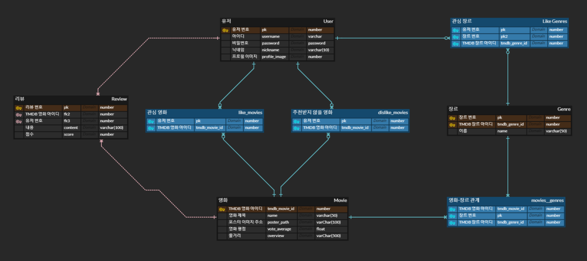

# MOVIE JOY

## THEME

> TMBD API를 사용한 영화 정보 실시간 업데이트
>
> 유저 선호 장르와 유저 리뷰 기반의 영화 추천 사이트

## Members

##	Plan of Features

* 3가지 영화 추천 카테고리
  * TMDB 인기 영화
  * 유저 선호 장르
  * 유저 리뷰 기반 높은 평점의 장르
* 소셜 로그인 
* 영화 관심 표시
* 유저의 관심 표시에 따라 추천받고 싶지 않은 영화 설정
* 리뷰, 평점 작성
* 현재 상영중인 영화, 개봉 예정 영화 데이터
* 음성인식
* 프로필 사진 
* 나만의 포토카드 꾸미기
* black & light 모드

=> 나만의 포토카드 꾸미기, black & light 모드 외 구현 완료

## ERD

> * TMDB API로 데이터를 불러온 후 
>
>   유저가 영화 카드를 클릭하면 Detail 페이지를 생성하며 
>
>   DB에 영화 정보를 저장
>
> * 별다른 update를 거치지 않아도 영화 데이터가 갱신 될 수 있음

## Features

### Login and Signup

**1. Login **

> * 카카오톡 로그인 서비스 구현

**2. Signup**

## 0511

#### 추천 알고리즘

- 선호 장르
- 리뷰 평점 관련 추천
- 전체 평점
- etc...

#### 기능

- 리뷰 작성 / 영화 상세 페이지에 작성 :exclamation:
- 야간 모드
- 해당 영화 추천받지 않음 :exclamation:
- 소셜 로그인
- 현재 상영 중인 영화
- 개봉 예정 영화 관심 체크 / 알림 :exclamation:
- 결제
- 음성 인식
- 나만의 포토 카드 꾸미기 :exclamation:
- etc...

#### 모델링

- **유저**

  `Abstractuser` + 관심 장르 

- **영화**

  `TMDB` API + 추천받지 않을 영화(유저 참조) + 관심있는 개봉 예정 영화(유저 참조) + 리뷰 참조

- **리뷰**

  일반적인 리뷰 + 유저 참조 + 평점 

