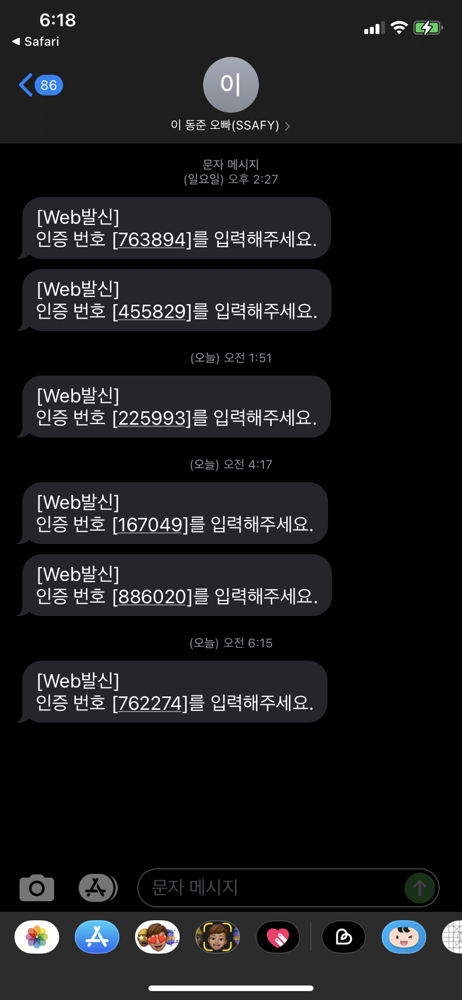

# MOVIE JOY

## THEME

> TMBD API를 사용한 영화 정보 실시간 업데이트
>
> 유저 선호 장르와 유저 리뷰 기반의 영화 추천 사이트

## Members

##	Plan of Features

* 3가지 영화 추천 카테고리
  * TMDB 인기 영화
  * 유저 선호 장르
  * 유저 리뷰 기반 높은 평점의 장르
* 소셜 로그인 
* 영화 관심 표시
* 유저의 관심 표시에 따라 추천받고 싶지 않은 영화 설정
* 리뷰, 평점 작성
* 현재 상영중인 영화, 개봉 예정 영화 데이터
* 음성인식
* 전화번호 인증에 따른 비밀번호 변경
* 프로필 사진 
* 나만의 포토카드 꾸미기
* black & light 모드

=> 나만의 포토카드 꾸미기, black & light 모드 외 구현 완료

## ERD

> * TMDB API로 데이터를 불러온 후 
>
>   유저가 영화 카드를 클릭하면 Detail 페이지를 생성하며 
>
>   DB에 영화 정보를 저장
>
> * 별다른 update를 거치지 않아도 영화 데이터가 갱신 될 수 있음

## Features

### Login and Signup

1. Login 

> * 카카오톡 로그인 서비스 구현

2. Signup

> * 유저 선호 장르 입력을 받은 후 DB에 데이터 저장

### Movie Recommend

> * TMDB popular 추천 영화
> * 유저 선호 장르 기반 추천 영화
> * 유저 리뷰 평점 기반 추천 영화
> * 3가지 추천 알고리즘의 영화들을 각 12개씩 페이지에 출력

## Genre Category

> * 선택한 장르에 따른 12개의 영화를 랜덤으로 추천

## Release Movie

> * 현재 상영 영화, 개봉 예정 영화들의 목록을 추천

## Search

> * 음성인식을 통한 검색어 입력 가능
> * 영화 title을 입력시 TMDB API를 통해 검색 결과들을 출력

## Movie Detail

1. Detail 페이지 전체 화면

> * 영화 트레일러 영상 
>
>   * TMDB API에 트레일러 정보가 없을 땐 
>
>     유튜브에서 해당 영화 제목을 검색하여 첫번째 영상을 출력
>
> * 영화 관심 정보 표시
>
>   * 아무런 관심 정보도 표시되지 않은 상태
>
>     
>
>   * 관심 영화 등록
>
>     
>
>   * 추천 제외 영화 등록
>
>     
>
> * Review 작성
>
>   
>
>   * 음성인식을 통한 리뷰 작성 가능
>   * 별점 부여 및 리뷰 수정, 삭제
>
> * 다른 사람의 Review 열람

## Under navbar

> * 페이지 스크롤을 top으로 올려주는 버튼
> * mypage 이동 router rink
> * 로그아웃 버튼
> * 유저 프로필 이미지 사진 
>   * 평소엔 이미지 사진만 뜨지만 클릭시 다른 3개의 버튼 활성화

## My Page

1. 기본 유저 프로필

> * 현재 유저 정보 표시
>   * 닉네임
>   * 선호 장르
>   * 리뷰 작성 목록, 별점 정보 => 클릭시 detail page modal 호출
> * 프로필 사진 변경

2. Like Movies

> * 지금까지 입력해둔 관심 영화 정보, 추천 제외 영화 목록을 출력
> * title 클릭시 detail page modal 호출

3. Auth

> * 

4. Settings

> * 유저 닉네임, 선호 영화 장르 변경 가능

## 느낀점

### 이동준

> 써라

### 조혜림

> 

